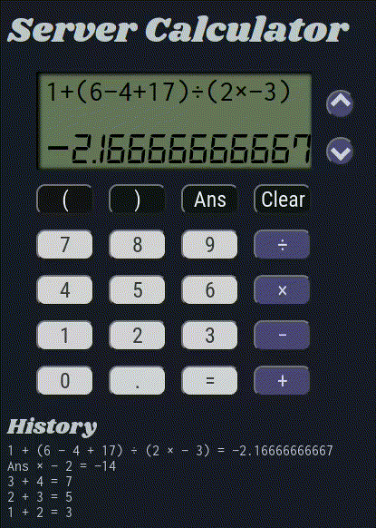

# Server Calculator

## Description

_Duration: 2 Week Sprint_

A calculator web application, which takes an arbitrary combination of numbers and arithmetic operations and evaluates the result.

Features implemented:
 * Replaces `*`, `-`, and `/` with `−`,  `×`, and `÷`, respectively, on key press
 * Evaluates sequences of arbitrary length
 * Respects proper order of operations (left to right, `×` and `÷` before `+` and `−`)
 * When input parsing fails, sends helpful message about what couldn't be parsed
 * Allows `Ans` or `Answer` keyword to refer to the value of the previous answer
 * Allows arbitrarily-nested parentheses to control the order of operations
 * Allows either keyboard or button input
 * Imitates the font and color scheme of a [TI-30XIIS calculator](https://education.ti.com/en/products/calculators/scientific-calculators/ti-30x-iis)
 * Allows history scrolling for input using up/down arrows

## Screen Shot

## Dependencies

Software required to install the app:
 - [Node.js](https://nodejs.org/en/)
 - [Express](https://expressjs.com/)
 - [Paren](https://www.npmjs.com/package/paren?activeTab=readme)

## Installing and Running Locally

Steps:

1. `npm install`
2. `npm start`
3. Open [localhost:8000](http://localhost:8000/) in your browser

